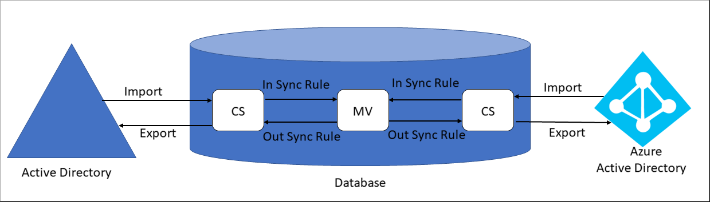
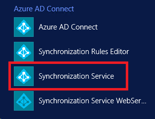
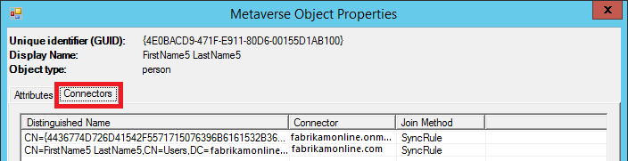
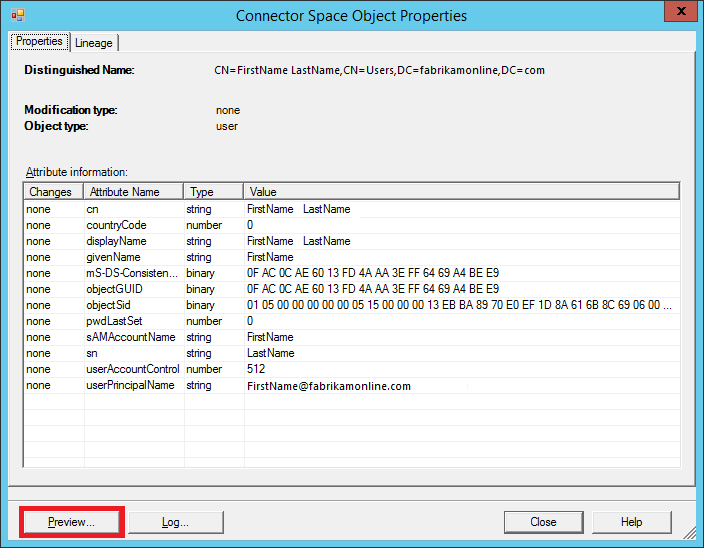
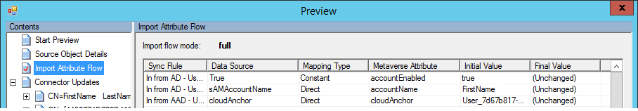
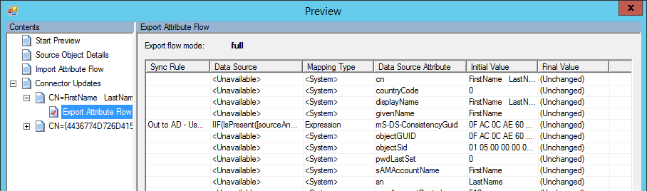

<properties
    pageTitle="Attribute not syncing"
    description="Attribute not syncing"
    service="microsoft.activedirectory"
    resource="activedirectory"
    authors="darora10"
    ms.author="deepakar"
    displayOrder=""
    selfHelpType="generic"
    supportTopicIds="32629808"
    resourceTags=""
    productPesIds="16666"
    cloudEnvironments="public"
    />

# Azure AD Connect: Attribute not syncing

## **Recommended Steps**

Before investigating attribute syncing issues, let’s understand the **Azure AD Connect** syncing process:

  

### **Terminology**

* CS: Connector Space, a table in database.
* MV: Metaverse, a table in database.

### **Synchronization Steps**

* Import from AD: Active Directory objects are brought into CS.

* Import from AAD: Azure Active Directory objects are brought into MV.

* Synchronizations: **Inbound Synchronization Rules** and **Outbound Synchronization Rules** are run in the order of precedence number from lower to higher. To view Synchronization Rules, you can go to **Synchronization Rules Editor** from the desktop applications.

* Export to AD: After running Synchronization, objects are exported from CS to **Active Directory**.

* Export to AAD: After running Synchronization, objects are exported from CS to **Azure Active Directory**.

### **Step by Step Investigation**

* We will start our search from the **Metaverse** and look at the attribute mapping from source to target.

* Launch **Synchronization Service Manager** from the desktop applications, as shown below:

  

* On the **Synchronization Service Manager**, select the **Metaverse Search**, select **Scope by Object Type**, select the object using an attribute, and click **Search** button.

  

* Double click the object found in the **Metaverse** search to view all its attributes. You can click on the **Connectors** tab to look at corresponding object in all the **Connector Spaces**.

  

* Double click on the **Active Directory Connector** to view the **Conector Space** attributes. Click on the **Preview** button, on the following dialog click on the **Generate Preview** button.

  

* Now click on the **Import Attribute Flow**, this shows flow of attributes from **Active Directory Connector Space** to the **Metaverse**. **Sync Rule** column shows which **Synchronization Rule** contributed to that attribute. **Data Source** column shows you the attributes from the **Connector Space**. **Metaverse Attribute** column shows you the attributes in the **Metaverse**. You can look for the attribute not syncing here. If you don't find the attribute here then this is not mapped and you have to create new custom **Synchronization Rule** to map the attribute.

  

* Click on the **Export Attribute Flow** in the left pane to view the attribute flow from **Metaverse** back to **Active Directory Connector Space** using **Outbound Synchronization Rules**.

  

* Similarly you can view the **Azure Active Directory Connector Space** object and can generate the **Preview** to view attribute flow from **Metaverse** to the **Connector Space** and vice versa, this way you can investigate why an attribute is not syncing.

## **Recommended Documents**
* [Azure AD Connect sync: Technical Concepts](https://docs.microsoft.com/azure/active-directory/hybrid/how-to-connect-sync-technical-concepts)
* [Azure AD Connect sync: Understanding the architecture](https://docs.microsoft.com/azure/active-directory/hybrid/concept-azure-ad-connect-sync-architecture)
* [Azure AD Connect sync: Understanding Declarative Provisioning](https://docs.microsoft.com/azure/active-directory/hybrid/concept-azure-ad-connect-sync-declarative-provisioning)
* [Azure AD Connect sync: Understanding Declarative Provisioning Expressions](https://docs.microsoft.com/azure/active-directory/hybrid/concept-azure-ad-connect-sync-declarative-provisioning-expressions)
* [Azure AD Connect sync: Understanding the default configuration](https://docs.microsoft.com/azure/active-directory/hybrid/concept-azure-ad-connect-sync-default-configuration)
* [Azure AD Connect sync: Understanding Users, Groups, and Contacts](https://docs.microsoft.com/azure/active-directory/hybrid/concept-azure-ad-connect-sync-user-and-contacts)
* [Azure AD Connect sync: Shadow attributes](https://docs.microsoft.com/azure/active-directory/hybrid/how-to-connect-syncservice-shadow-attributes)