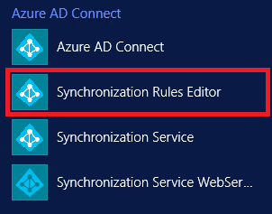
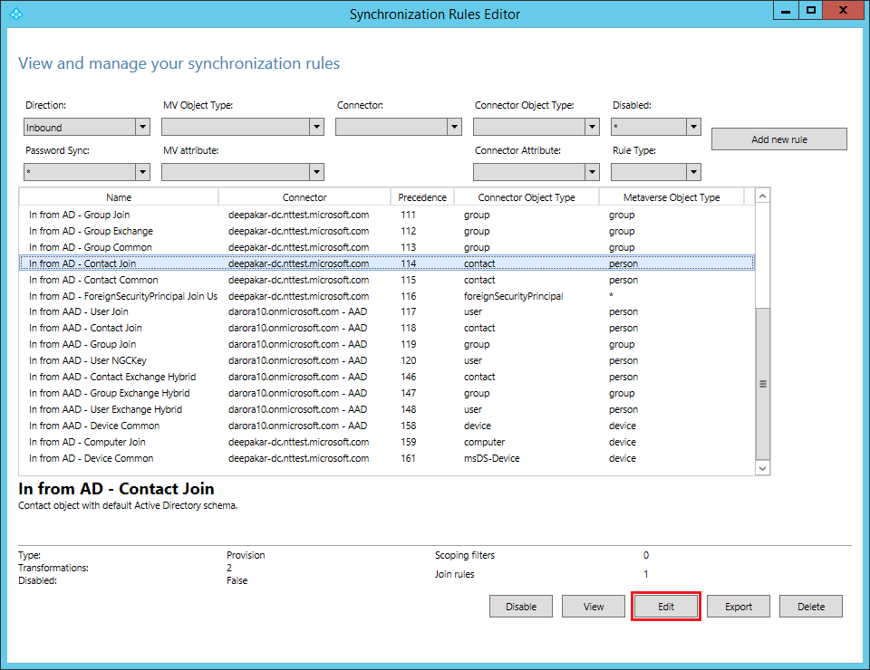

<properties
    pageTitle="How to customize a synchronization rule"
    description="How to customize a synchronization rule"
    service="microsoft.activedirectory"
    resource="activedirectory"
    authors="darora10"
    ms.author="deepakar"
    displayOrder=""
    selfHelpType="generic"
    supportTopicIds="32629773"
    resourceTags=""
    productPesIds="16666"
    cloudEnvironments="public"
    />

# How to customize a synchronization rule

## **Recommended Steps**
You can use synchronization rule editor to edit or create a new synchronization rule. Please note that you need to be an advanced user to make changes in synchronization rule. Any wrong changes may result in deletion of objects from target directory. Please read [Recommended Documents](#recommended-documents) to gain expertise in synchronization rules. To modify a synchronization rules go through following steps:

* Launch synchronization editor from application menu in desktop as shown below:

    

* In order to customize a default synchronization rule, clone the existing rule by clicking “Edit” button on the Synchronization Rules Editor, which will create a copy of standard rule and disable standard rule. Save cloned rule with precedence less than 100, which means a synchronization rule with a lower numeric value in precedence has a higher precedence and in case of an attribute flow conflict, higher precedence will win the conflict resolution. Ideally you should only keep the modifying attribute in the cloned rule and remove others and then enable default rule so that modified attribute comes from cloned rule and other attributes are picked from default standard rule. Please note that in case calculated value of modified attribute is NULL in your cloned rule and is not NULL in the default standard rule then not NULL value will win and will replace NULL value. If you don’t want NULL value to be replace with not NULL value then assign AuthoritativeNull in your cloned rule. 

    

* If you want to modify **Outbound** rule then change filter from above editor.

## **Recommended Documents**
* [Azure AD Connect sync: Technical Concepts](https://docs.microsoft.com/azure/active-directory/hybrid/how-to-connect-sync-technical-concepts)
* [Azure AD Connect sync: Understanding the architecture](https://docs.microsoft.com/azure/active-directory/hybrid/concept-azure-ad-connect-sync-architecture)
* [Azure AD Connect sync: Understanding Declarative Provisioning](https://docs.microsoft.com/azure/active-directory/hybrid/concept-azure-ad-connect-sync-declarative-provisioning)
* [Azure AD Connect sync: Understanding Declarative Provisioning Expressions](https://docs.microsoft.com/azure/active-directory/hybrid/concept-azure-ad-connect-sync-declarative-provisioning-expressions)
* [Azure AD Connect sync: Understanding the default configuration](https://docs.microsoft.com/azure/active-directory/hybrid/concept-azure-ad-connect-sync-default-configuration)
* [Azure AD Connect sync: Understanding Users, Groups, and Contacts](https://docs.microsoft.com/azure/active-directory/hybrid/concept-azure-ad-connect-sync-user-and-contacts)
* [Azure AD Connect sync: Shadow attributes](https://docs.microsoft.com/azure/active-directory/hybrid/how-to-connect-syncservice-shadow-attributes)