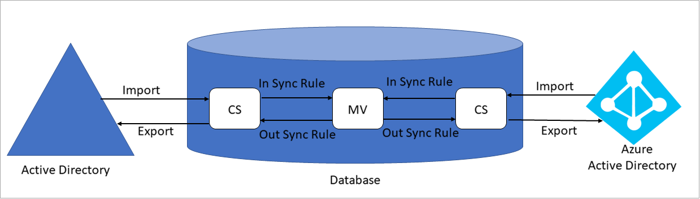
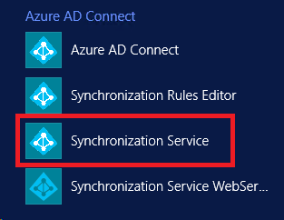
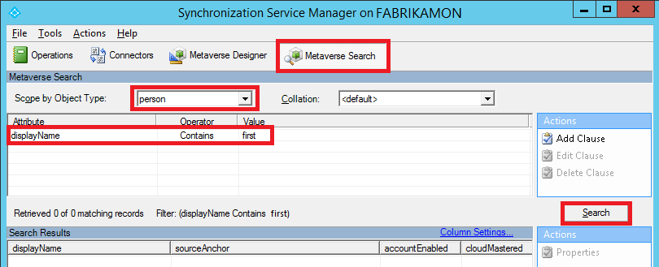
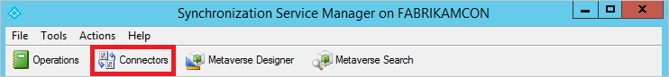
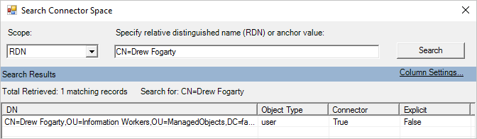
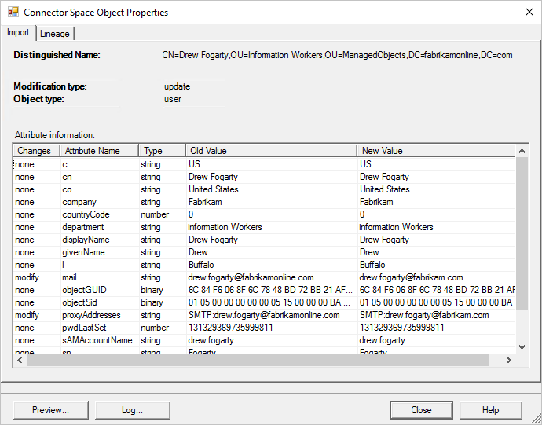
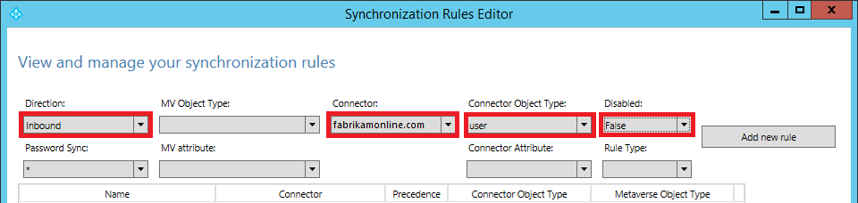
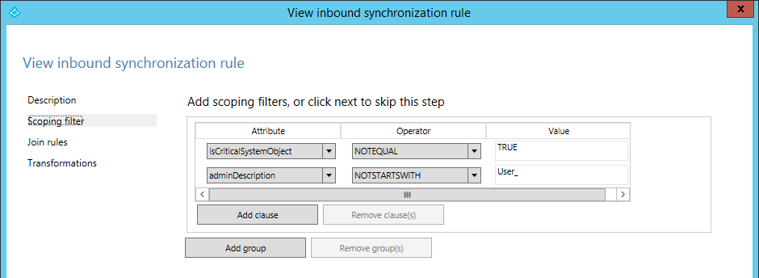
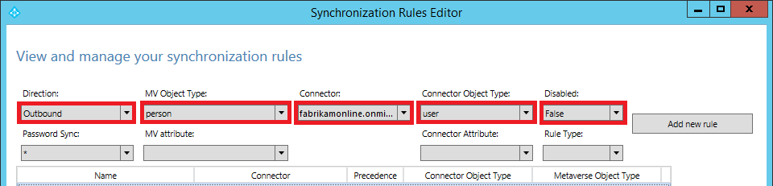

<properties
    pageTitle="Object not syncing"
    description="Object not syncing"
    service="microsoft.activedirectory"
    resource="activedirectory"
    authors="darora10"
    ms.author="deepakar"
    displayOrder=""
    selfHelpType="generic"
    supportTopicIds="32629809"
    resourceTags=""
    productPesIds="16666"
    cloudEnvironments="public"
    />

# Azure AD Connect: Object not syncing

If you find that an object is not syncing or UPN mismatch then use [Azure AD Connect troubleshooting task]( https://docs.microsoft.com/azure/active-directory/hybrid/tshoot-connect-objectsync) to investigate and resolve the issue.

If troubleshooting task didn’t help you then go through [Recommended Steps](#recommended-steps) below to investigate and trouble the issue.

>[!NOTE]
>If an on-premise user object being mapped to an online user with **Global Administrator Role**. Then this user will not be synced because of security risks.

## **Recommended Steps**

Before investigating syncing issues, let’s understand the **Azure AD Connect** syncing process:

  

### **Terminology**

* CS: Connector Space, a table in database.
* MV: Metaverse, a table in database.
* AD: Active Directory
* AAD: Azure Active Directory

### **Synchronization Steps**

* Import from AD: Active Directory objects are brought into AD CS.

* Import from AAD: Azure Active Directory objects are brought into AAD CS.

* Synchronization: **Inbound Synchronization Rules** and **Outbound Synchronization Rules** are run in the order of precedence number from lower to higher. To view the Synchronization Rules, you can go to **Synchronization Rules Editor** from the desktop applications. The **Inbound Synchronization Rules** brings in data from CS to MV. The **Outbound Synchronization Rules** moves data from MV to CS.

* Export to AD: After running Synchronization, objects are exported from CS to **Active Directory**.

* Export to AAD: After running Synchronization, objects are exported from CS to **Azure Active Directory**.

### **Step by Step Investigation**

* We will start our search from the **Metaverse** and then proceed towards left or right in the above diagram based on whether we have found the object or not.

* Launch **Synchronization Service Manager** from the desktop applications, as shown below:

  

* On the **Synchronization Service Manager**, select the **Metaverse Search**, select **Scope by Object Type**, select the object using an attribute, and click **Search** button.

  

* If you don't find the object in the **Metaverse** then search in the **Connector Space** of the **Active Directory**. Click **Connectors** on the **Synchronization Service Manager**, select the **Active Directory Connector** from the list, right click and select **Search Connector Space**.

  

* In the **Scope**, select **RDN** (when you want to search on the CN attribute) or **DN or Anchor** (when you want to search on the distinguishedName attribute). Enter a value and click **Search**. If you don't find the object you are looking for then this is an import issue, this could be because of permission issues on the object. Please follow [instructions in this document]( https://docs.microsoft.com/azure/active-directory/hybrid/how-to-connect-configure-ad-ds-connector-account#configure-ad-ds-connector-account-permissions) to assign correct permissions.

  

* If you find the object in the **Connector Space**, then there is an issue in the scoping filter in the **Synchronization Rules**. To check scoping filters, double click the object to see all its attributes.

  

* Now to look at the scoping filter go to the desktop application menu and click on **Synchronization Rules Editor**, view each rule in the filtered list and check the **Scoping filter**. Please note that if the attributes meet the **Scoping filter** criteria then they are in scope otherwise they are out of scope. Out of scope objects will not make their way to the **Metaverse**. That apart the **Connector Space** attribute will show all the non-null and non-empty attributes. For example, if **isCriticalSystemObject** is not showing up in the list, then this means that the value of this attribute is null or empty.

  

* In the below scoping filter, if the **isCriticalSystemObject** value is null or FALSE or empty then it's in scope.

  

* If you have found the object in the **Metaverse** then double click on it to view all its attributes. You can click on the **Connectors** tab to look at corresponding object in all the **Connector Spaces**.

  

* If the object is not present in the **Connector Space** of **Azure Active Directory**, then you need to look at the Scoping filter in the **Outbound** rules of the corresponding **Connector Space** and check if the object is filtered out because of the **Metaverse** attributes not meeting the criteria.

  

## **Recommended Documents**
* [Azure AD Connect sync: Technical Concepts](https://docs.microsoft.com/azure/active-directory/hybrid/how-to-connect-sync-technical-concepts)
* [Azure AD Connect sync: Understanding the architecture](https://docs.microsoft.com/azure/active-directory/hybrid/concept-azure-ad-connect-sync-architecture)
* [Azure AD Connect sync: Understanding Declarative Provisioning](https://docs.microsoft.com/azure/active-directory/hybrid/concept-azure-ad-connect-sync-declarative-provisioning)
* [Azure AD Connect sync: Understanding Declarative Provisioning Expressions](https://docs.microsoft.com/azure/active-directory/hybrid/concept-azure-ad-connect-sync-declarative-provisioning-expressions)
* [Azure AD Connect sync: Understanding the default configuration](https://docs.microsoft.com/azure/active-directory/hybrid/concept-azure-ad-connect-sync-default-configuration)
* [Azure AD Connect sync: Understanding Users, Groups, and Contacts](https://docs.microsoft.com/azure/active-directory/hybrid/concept-azure-ad-connect-sync-user-and-contacts)
* [Azure AD Connect sync: Shadow attributes](https://docs.microsoft.com/azure/active-directory/hybrid/how-to-connect-syncservice-shadow-attributes)