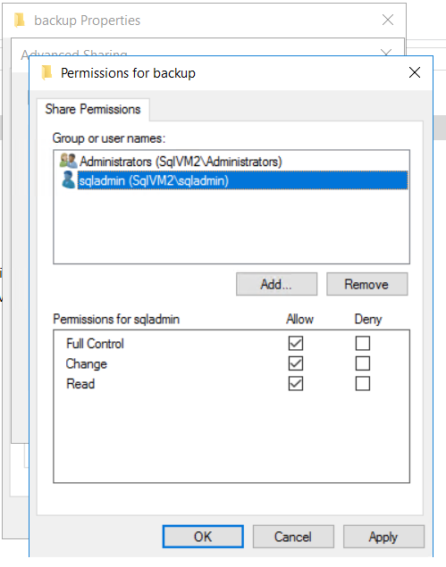
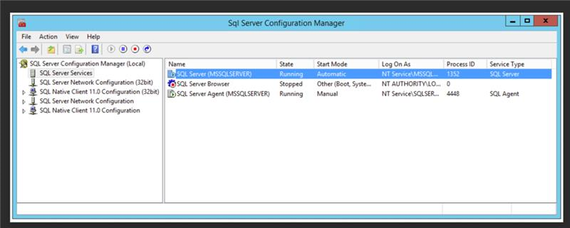
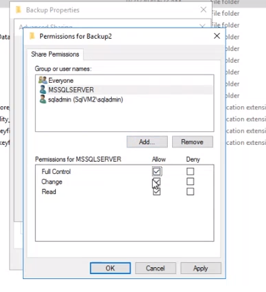

<properties
	pageTitle="Planning and Configuration for Migration to Azure SQL DB Managed Instance"
	description="Planning and Configuration"
	infoBubbleText=""
	service="microsoft.dms"
	resource="virtualmachines"
	authors="radjaram"
	ms.author="rradjou"
	displayOrder="1"
	articleId="planning-config-sqldbmi"
	diagnosticScenario=""
	selfHelpType="generic"
	supportTopicIds="32743217"
	resourceTags=""
	productPesIds="16307"
	cloudEnvironments="public, fairfax, usnat, ussec"
	ownershipId="AzureData_AzureDatabaseMigrationService"
/>

# Planning and Configuration for SQL DB Managed Instance Migrations

## Information on setting up database migration to Azure SQL Database Managed Instance in online mode

## **Recommended Documents**

* [Tutorial: Migrate SQL Server to an Azure SQL Database managed instance online using DMS](https://docs.microsoft.com/azure/dms/tutorial-sql-server-managed-instance-online) 
* [Powershell script for MI online migration](#Powershell-script-for-MI-online-migration)
* [Video: How to migrate a SQL Server 2008 or SQL Server 2008 R2 workload to Azure SQL Database Managed Instance](https://azure.microsoft.com/resources/videos/how-to-migrate-sql-server-2008-or-r2-to-azure-sqldbmi) 
* [Blog: Migration from SQL Server to Azure SQL Database Managed Instance](https://blogs.technet.microsoft.com/hybridcloudbp/2018/11/02/migration-from-sql-server-to-azure-sql-database-managed-instance) 
* [Migrate certificate of TDE protected database to Azure SQL Database Managed Instance](https://docs.microsoft.com/azure/sql-database/sql-database-managed-instance-migrate-tde-certificate) 
* [Database Migration Guide](https://datamigration.microsoft.com/)

## Information on setting up database migration to Azure SQL Database Managed Instance in offline mode

## **Recommended Documents**

* [Tutorial: Migrate SQL Server to an Azure SQL Database managed instance offline using DMS](https://docs.microsoft.com/azure/dms/tutorial-sql-server-to-managed-instance) 
* [Powershell script for MI offline migration](#Powershell-script-for-MI-offline-migration)
* [Blog: Migration from SQL Server to Azure SQL Database Managed Instance](https://blogs.technet.microsoft.com/hybridcloudbp/2018/11/02/migration-from-sql-server-to-azure-sql-database-managed-instance) 
* [Migrate SQL Server Integration Services packages to an Azure SQL Database managed instance](https://docs.microsoft.com/azure/dms/how-to-migrate-ssis-packages-managed-instance) 
* [Migrate certificate of TDE protected database to Azure SQL Database Managed Instance](https://docs.microsoft.com/azure/sql-database/sql-database-managed-instance-migrate-tde-certificate) 
* [Database Migration Guide](https://datamigration.microsoft.com/)

## Migration Project and Activity Configuration

## **Recommended Documents**

* [How to create a File Share for MI migration](#Steps-for-creating-File-share)
* [SQL Server to SQL DB managed instance offline](https://docs.microsoft.com/azure/dms/tutorial-sql-server-to-managed-instance#create-a-migration-project) 
* [SQL Server to SQL DB managed instance online](https://docs.microsoft.com/azure/dms/tutorial-sql-server-managed-instance-online#create-a-migration-project) 
* [Custom roles for SQL Server to SQL DB managed instance online migrations](https://docs.microsoft.com/azure/dms/resource-custom-roles-sql-db-managed-instance) 
* [Network topologies for Azure SQL DB Managed Instance migrations](https://docs.microsoft.com/azure/dms/resource-custom-roles-sql-db-managed-instance) 
* [Migrate SQL Server to SQL DB managed instance with PowerShell](https://docs.microsoft.com/azure/dms/howto-sql-server-to-azure-sql-mi-powershell)  

## Steps for creating File share

Verify Network connectivity is setup between DMS subnet and Source SQL

Simplest way to verify this - Deploy a test VM in DMS subnet and try to connect to source SQL using SSMS

Verify if Restore header is working on source SQL Server with backup present in fileshare folder RESTORE HEADERONLY FROM DISK = N'\10.2.0.5\backup\full.bak' (the path used here should be same as what will be provided in step#4 “Configure Migration Settings”)

Add Windows account used for migration( this should be same account as what will be provided in step#4 “Configure Migration Settings”)

Add permissions for SQL Server Service account on Fileshare

You may find SQL Server Service account in “SQL Server Configuration Manager” on source SQL Server.

## Powershell script for MI online migration

    # DMS specific properties
    $dmsSubscriptionName = "<mysubscriptionname>"
    $dmsResourceGroupName = "<myrg>"
    $dmsServiceName = "<myservice>"
    $dmsProjectName = "<myproject>"
    $dmsLocation = "centralus"

    # Select subscription
    Select-AzSubscription -SubscriptionName $dmsSubscriptionName 

    # Create DMS project
    $project = New-AzDataMigrationProject `
      -ResourceGroupName $dmsResourceGroupName `
      -ServiceName $dmsServiceName `
      -ProjectName $dmsProjectName `
      -Location $dmsLocation `
      -SourceType SQL `
      -TargetType SQLMI `

    # Managed Instance online migration properties
    $dmsTaskName = "testmigration1"

    # Source connection properties
    $sourceDataSource = "mysqlserver.domain.com"
    $sourceUserName = "domain\user"
    $sourcePassword = "mypassword"

    # Target MI connection properties
    $targetMIResourceId = "/subscriptions/<subid>/resourceGroups/<rg>/providers/Microsoft.Sql/managedInstances/<myMI>"
    $targetUserName = "<user>"
    $targetPassword = "<password>"

    # SMB Backup share properties
    $smbBackupSharePath = "\\shareserver.domain.com\mybackup"
    $smbBackupShareUserName = "domain\user"
    $smbBackupSharePassword = "<password>"

    # Selected databases (Source database name to target database name mapping)
    $selectedDatabasesMap = New-Object System.Collections.Generic.Dictionary"[String,String]" 
    $selectedDatabasesMap.Add("testdb1src", "testdb1target")

    # AAD properties
    $AADAppId = "<appid-guid>"
    $AADAppKey = "<app-key>"

    # Create source connection info
    $sourceConnInfo = New-AzDmsConnInfo -ServerType SQL `
      -DataSource $sourceDataSource `
      -AuthType WindowsAuthentication `
      -TrustServerCertificate:$true
    $sourcePasswordSecure = ConvertTo-SecureString -String $sourcePassword -AsPlainText -Force
    $sourceCredentials = New-Object System.Management.Automation.PSCredential ($sourceUserName, $sourcePasswordSecure)

    # Create target connection info
    $targetConnInfo = New-AzDmsConnInfo -ServerType SQLMI `
        -MiResourceId $targetMIResourceId
    $targetPasswordSecure = ConvertTo-SecureString -String $targetPassword -AsPlainText -Force
    $targetCredentials = New-Object System.Management.Automation.PSCredential ($targetUserName, $targetPasswordSecure)

    # Create AAD object
    $AADAppKeySecure = ConvertTo-SecureString $AADAppKey -AsPlainText -Force
    $AADApp = New-AzDmsAadApp -ApplicationId $AADAppId -AppKey $AADAppKeySecure

    # Create backup file share object
    $smbBackupSharePasswordSecure = ConvertTo-SecureString -String $smbBackupSharePassword -AsPlainText -Force
    $smbBackupShareCredentials = New-Object System.Management.Automation.PSCredential ($smbBackupShareUserName, $smbBackupSharePasswordSecure)
    $backupFileShare = New-AzDmsFileShare -Path $smbBackupSharePath -Credential $smbBackupShareCredentials

    # Create selected databases object
    $selectedDatabases = @();
    foreach ($sourceDbName in $selectedDatabasesMap.Keys){
        $targetDbName = $($selectedDatabasesMap[$sourceDbName])
        $selectedDatabases += New-AzDmsSelectedDB -MigrateSqlServerSqlDbMi `
          -Name $sourceDbName `
          -TargetDatabaseName $targetDbName `
          -BackupFileShare $backupFileShare `
    }

    # Storage resource id
    $storageAccountResourceId = "/subscriptions/<subscriptionname>/resourceGroups/<rg>/providers/Microsoft.Storage/storageAccounts/<mystorage>"

    # Create DMS migration task
    $migTask = New-AzDataMigrationTask -TaskType MigrateSqlServerSqlDbMiSync `
      -ResourceGroupName $dmsResourceGroupName `
      -ServiceName $dmsServiceName `
      -ProjectName $dmsProjectName `
      -TaskName $dmsTaskName `
      -SourceConnection $sourceConnInfo `
      -SourceCred $sourceCredentials `
      -TargetConnection $targetConnInfo `
      -TargetCred $targetCredentials `
      -SelectedDatabase  $selectedDatabases `
      -BackupFileShare $backupFileShare `
      -AzureActiveDirectoryApp $AADApp `
      -StorageResourceId $storageAccountResourceId

    # Get migration task status details
    $migTask = Get-AzDataMigrationTask `
                        -ResourceGroupName $dmsResourceGroupName `
                        -ServiceName $dmsServiceName `
                        -ProjectName $dmsProjectName `
                        -Name $dmsTaskName `
                        -ResultType DatabaseLevelOutput `
                        -Expand

    # Task state will be either of 'Queued', 'Running', 'Succeeded', 'Failed', 'FailedInputValidation' or 'Faulted'
    $taskState = $migTask.ProjectTask.Properties.State

    # Display task state
    $taskState | Format-List

    # Get task errors
    $taskErrors = $migTask.ProjectTask.Properties.Errors

    # Display task errors
    foreach($taskError in $taskErrors){
        $taskError |  Format-List
    }

    # Get database level details
    $databaseLevelOutputs = $migTask.ProjectTask.Properties.Output

    # Display database level details
    foreach($databaseLevelOutput in $databaseLevelOutputs){

        # This is the source database name.
        $databaseName = $databaseLevelOutput.SourceDatabaseName;

        Write-Host "=========="
        Write-Host "Start migration details for database " $databaseName
        # This is the status for that database - It will be either of:
        # INITIAL, FULL_BACKUP_UPLOADING, FULL_BACKUP_UPLOADED, LOG_FILES_UPLOADING,
        # CUTOVER_IN_PROGRESS, CUTOVER_INITIATED, CUTOVER_COMPLETED, COMPLETED, CANCELLED, FAILED
        $databaseMigrationState = $databaseLevelOutput.MigrationState;

        # Details about last restored backup. This contains file names, LSN, backup date, etc 
        $databaseLastRestoredBackup = $databaseLevelOutput.LastRestoredBackupSetInfo
            
        # Details about last restored backup. This contains file names, LSN, backup date, etc 
        $databaseLastRestoredBackup = $databaseLevelOutput.LastRestoredBackupSetInfo

        # Details about last Currently active/most recent backups. This contains file names, LSN, backup date, etc 
        $databaseActiveBackpusets = $databaseLevelOutput.ActiveBackupSets

        # Display info
        $databaseLevelOutput | Format-List

        Write-Host "Currently active/most recent backupset details:"
        $databaseActiveBackpusets  | select BackupStartDate, BackupFinishedDate, FirstLsn, LastLsn -ExpandProperty ListOfBackupFiles | Format-List

        Write-Host "Last restored backupset details:"
        $databaseLastRestoredBackupFiles  | Format-List

        Write-Host "End migration details for database " $databaseName
        Write-Host "=========="
    }

    # Initiate Cutover
    $command = Invoke-AzDmsCommand -CommandType CompleteSqlMiSync `
                                  -ResourceGroupName $dmsResourceGroupName `
                                  -ServiceName $dmsServiceName `
                                  -ProjectName $dmsProjectName `
                                  -TaskName $dmsTaskName `
                                  -DatabaseName "testdb1src"

## Powershell script for MI offline migration

    # DMS specific properties
    $dmsSubscriptionName = "<mysubscriptionname>"
    $dmsResourceGroupName = "<myrg>"
    $dmsServiceName = "<myservice>"
    $dmsProjectName = "<myproject>"
    $dmsLocation = "centralus"

    # Select subscription
    Select-AzSubscription -SubscriptionName $dmsSubscriptionName 

    # Create DMS project
    $project = New-AzDataMigrationProject `
      -ResourceGroupName $dmsResourceGroupName `
      -ServiceName $dmsServiceName `
      -ProjectName $dmsProjectName `
      -Location $dmsLocation `
      -SourceType SQL `
      -TargetType SQLMI `

    # Managed Instance offline migration properties
    $dmsTaskName = "testmigration1"

    # Source connection properties
    $sourceDataSource = "mysqlserver.domain.com"
    $sourceUserName = "domain\user"
    $sourcePassword = "mypassword"

    # Target MI connection properties
    $targetMIDataSource = "targetmi.database.windows.net"
    $targetUserName = "<user>"
    $targetPassword = "<password>"

    # SMB Backup share properties
    $smbBackupSharePath = "\\shareserver.domain.com\mybackup"
    $smbBackupShareUserName = "domain\user"
    $smbBackupSharePassword = "<password>"

    # Selected databases (Source database name to target database name mapping)
    $selectedDatabasesMap = New-Object System.Collections.Generic.Dictionary"[String,String]" 
    $selectedDatabasesMap.Add("testdb1src", "testdb1target")

    # Create source connection info
    $sourceConnInfo = New-AzDmsConnInfo -ServerType SQL `
      -DataSource $sourceDataSource `
      -AuthType WindowsAuthentication `
      -TrustServerCertificate:$true
    $sourcePasswordSecure = ConvertTo-SecureString -String $sourcePassword -AsPlainText -Force
    $sourceCredentials = New-Object System.Management.Automation.PSCredential ($sourceUserName, $sourcePasswordSecure)

    # Create target connection info
    $targetConnInfo = New-AzDmsConnInfo -ServerType SQL `
        -DataSource $targetMIDataSource `
        -AuthType SQLAuthentication
    $targetPasswordSecure = ConvertTo-SecureString -String $targetPassword -AsPlainText -Force
    $targetCredentials = New-Object System.Management.Automation.PSCredential ($targetUserName, $targetPasswordSecure)

    # Create backup file share object
    $smbBackupSharePasswordSecure = ConvertTo-SecureString -String $smbBackupSharePassword -AsPlainText -Force
    $smbBackupShareCredentials = New-Object System.Management.Automation.PSCredential ($smbBackupShareUserName, $smbBackupSharePasswordSecure)
    $backupFileShare = New-AzDmsFileShare -Path $smbBackupSharePath -Credential $smbBackupShareCredentials

    # Create selected databases object
    $selectedDatabases = @();
    foreach ($sourceDbName in $selectedDatabasesMap.Keys){
        $targetDbName = $($selectedDatabasesMap[$sourceDbName])
        $db = New-AzDmsSelectedDB -MigrateSqlServerSqlDbMi `
          -Name $sourceDbName `
          -TargetDatabaseName $targetDbName `
          -BackupFileShare $backupFileShare
        # Optionally, set BackupFilePaths if using ExistingBackups.
        # Set backupFilePaths property explicitly on the object 
        # $backupFilePaths = [System.Collections.Generic.List[string]]@("server\folder\db1stripe1.fullbak","server\folder\db1strip2.fullbak")
        # $db.BackupFilePaths = $backupFilePaths
        $selectedDatabases += $db
    }

    # Storage blob SAS URI
    $blobSasUri = "<storage_container_SAS_URI>"

    # Create DMS migration task
    $migTask = New-AzDataMigrationTask -TaskType MigrateSqlServerSqlDbMi `
      -ResourceGroupName $dmsResourceGroupName `
      -ServiceName $dmsServiceName `
      -ProjectName $dmsProjectName `
      -TaskName $dmsTaskName `
      -SourceConnection $sourceConnInfo `
      -SourceCred $sourceCredentials `
      -TargetConnection $targetConnInfo `
      -TargetCred $targetCredentials `
      -SelectedDatabase  $selectedDatabases `
      -BackupFileShare $backupFileShare `
      -BackupBlobSasUri $blobSasUri
    # Optionally, add -BackupMode 'ExistingBackup' to use existing backups
      
    # Get migration task status details
    $migTask = Get-AzDataMigrationTask `
                        -ResourceGroupName $dmsResourceGroupName `
                        -ServiceName $dmsServiceName `
                        -ProjectName $dmsProjectName `
                        -Name $dmsTaskName `
                        -ResultType DatabaseLevelOutput `
                        -Expand

    # Task state will be either of 'Queued', 'Running', 'Succeeded', 'Failed', 'FailedInputValidation' or 'Faulted'
    $taskState = $migTask.ProjectTask.Properties.State

    # Display task state
    $taskState | Format-List

    # Get task errors
    $taskErrors = $migTask.ProjectTask.Properties.Errors

    # Display task errors
    foreach($taskError in $taskErrors){
        $taskError |  Format-List
    }

    # Get database level details
    $databaseLevelOutputs = $migTask.ProjectTask.Properties.Output

    # Display database level details
    foreach($databaseLevelOutput in $databaseLevelOutputs){

        # This is the source database name.
        $databaseName = $databaseLevelOutput.SourceDatabaseName;

        Write-Host "=========="
        Write-Host "Start migration details for database " $databaseName
        # This is the status for that database
        $databaseMigrationState = $databaseLevelOutput.MigrationState;

        # Display info
        $databaseLevelOutput | Format-List

        Write-Host "End migration details for database " $databaseName
        Write-Host "=========="
    }